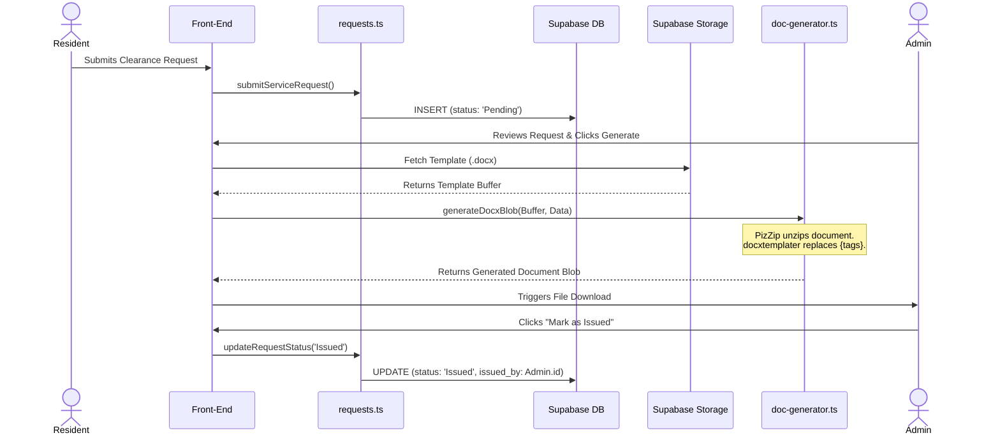

# Document Generation & Service Flow: Study Guide

Welcome to the deep-dive interactive guide for **Document Services** in **Konektado**. This guide leverages the LinkMarkdown format to explain exactly how citizens request documents, how templates are managed, and the precise logic behind injecting data into official files.

## 1. The Service Request Pipeline

Everything starts when a resident requests a document (e.g., Barangay Clearance or Certificate of Indigency). The system stores this in the `clearance_requests` table with a status of `Pending`. 

👉 **View Code:** [submitServiceRequest() logic](./src/lib/requests.ts#L45-L63)

When an official processes the request, the status is updated to `Issued`, and the system logs which admin issued the document for strict accountability.

👉 **View Code:** [updateRequestStatus() logic](./src/lib/requests.ts#L68-L92)

## 2. Managing Document Templates

Instead of hardcoding the layout of every document, the system allows admins to upload `.docx` templates to **Supabase Storage**. This means the barangay can change the wording of a clearance without requiring a code update.

👉 **View Code:** [uploadTemplate() function](./src/lib/storage.ts#L9-L28)

## 3. The Logic Behind Document Insertion

When an admin clicks "Generate", how does the system insert the resident's name into a `.docx` file? 

We use two critical libraries: **PizZip** (to unzip the `.docx` structure) and **docxtemplater** (to find and replace specific tags). The function takes the raw binary buffer of the template, searches for tags, injects the resident data, and returns a new downloadable Blob.

👉 **View Code:** [generateDocxBlob() insertion logic](./src/lib/doc-generator.ts#L29-L48)

To ensure this works perfectly, the uploaded Word documents must use exact placeholder tags (e.g., `{fullName}`, `{purpose}`).

👉 **View Code:** [Required Template Tags](./src/lib/doc-generator.ts#L54-L65)

## 4. PDF Generation (Deprecated)

Previously, the system supported an alternative canvas-based PDF generation using **jsPDF**. This feature was removed to prioritize the more accurate and customizable `.docx` templating system. Any manual issuance now relies entirely on creating a queue request and utilizing the DOCX templates.

## 5. Visualizing the Process

Here is how the entire document generation lifecycle looks:

## Summary

By exploring the specific snippets linked above, you can see how:
1. Citizens enqueue requests.
2. Admins securely upload template files to Supabase.
3. The system parses `.docx` files using `docxtemplater` to dynamically inject resident data.
