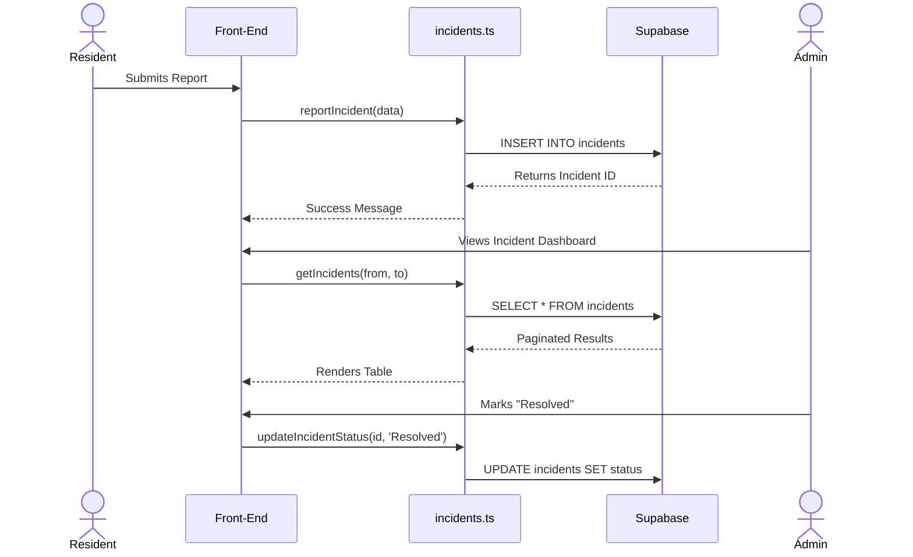

# Barangay Management System: Codebase Study Guide

Welcome to the **Barangay Management System** interactive documentation! This guide leverages our "LinkMarkdown" structure to help you understand how the system is architected, bridging the gap between high-level concepts and exact code implementations.

Instead of hunting through folders or blindly prompting for answers, you can follow this narrative.

## 1. Core Architecture & Supabase Integration

The system relies heavily on **Supabase** as the Backend-as-a-Service (BaaS) for PostgreSQL database access, authentication, and real-time features.

Everything starts with the client initialization. The app creates a single Supabase client instance that both the server and client components can use to interact with our database.

👉 **View Code:** [Supabase Client Initialization](./src/lib/supabase.ts#L7-L14)

## 2. Managing Incidents

One of the main features is allowing residents to report incidents and giving admins a way to track and resolve them. The `incidents.ts` file acts as the Data Access Layer (DAL) for everything related to incidents.

### Fetching & Pagination
We implemented pagination using Supabase's `.range()` function to optimize loading times instead of fetching all incidents at once.

👉 **View Code:** [getIncidents() function](./src/lib/incidents.ts#L17-L39)

### Reporting an Incident
When a resident submits an incident via the self-service portal, the system writes directly to the `incidents` table.

👉 **View Code:** [reportIncident() function](./src/lib/incidents.ts#L69-L82)

### Real-Time Updates & Status Changes
Admins can mark incidents as "In Progress" or "Resolved". This function updates the status, which can then trigger real-time UI updates (if listening to Supabase changes).

👉 **View Code:** [updateIncidentStatus() function](./src/lib/incidents.ts#L110-L129)

## 3. Automated Document Generation

Manual processing of documents is a thing of the past. The system generates `.docx` files on the fly by combining dynamic resident data with pre-uploaded Word document templates.

We use **docxtemplater** and **PizZip** to read a Word document's structure and substitute placeholders.

👉 **View Code:** [generateDocxBlob() logic](./src/lib/doc-generator.ts#L29-L48)

The system relies on strict tags to map data correctly to the document. Admins must format their template files using these exact keys:

👉 **View Code:** [DOCUMENT_TAGS constant](./src/lib/doc-generator.ts#L54-L65)

## 4. Visualizing the Incident Flow

Here is a simple Mermaid diagram to visualize the flow of how an incident goes from submission to resolution:

## 5. Resident Management

A barangay needs a reliable database of its citizens. The `residents.ts` file acts as the DAL for creating, updating, and querying resident records. Notice how we use pagination (`.range()`) and search filtering to make lookups fast and efficient.

We also use "soft deletes" (archiving) instead of hard deletions to preserve records.

👉 **View Code:** [getResidents() function](./src/lib/residents.ts#L15-L49)
👉 **View Code:** [archiveResident() function](./src/lib/residents.ts#L100-L110)

## 6. Service Requests Queue

Citizens request documents (like Barangay Clearance or Certificate of Indigency) through the portal. The `requests.ts` module manages these submissions.

When an admin approves and issues a document, the system automatically tags the time and the admin who issued it for accountability.

👉 **View Code:** [updateRequestStatus() function](./src/lib/requests.ts#L68-L92)
👉 **View Code:** [getServiceRequests() function](./src/lib/requests.ts#L15-L40)

## 7. Database Schema & Audit Logging

The backend truth lies in the `supabase_schema.sql` file. It defines tables, constraints, and Row Level Security (RLS) to ensure that only authorized users can read or write data.

A crucial feature of this system is the **Audit Logging System**. To maintain accountability and comply with the Data Privacy Act (DPA), every insert, update, or delete on sensitive tables triggers a PostgreSQL function that logs the change.

👉 **View Code:** [Audit Logs Table Schema](./supabase_schema.sql#L156-L165)
👉 **View Code:** [Audit Logging Trigger Function](./supabase_schema.sql#L178-L196)

## Summary

By exploring the specific snippets linked above, you can confidently navigate the **Barangay System**. You've now seen exactly how:
1. The database client connects.
2. The schema enforces security and audit logging.
3. Resident profiles are searched and safely archived.
4. The data access layer handles incident data and document requests.
5. Templates are dynamically populated to generate official documents.

Feel free to expand this file as you build out new features!
